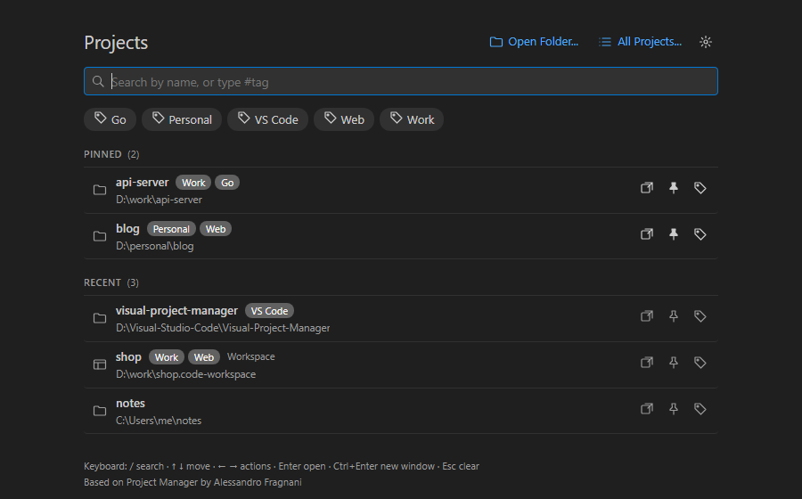
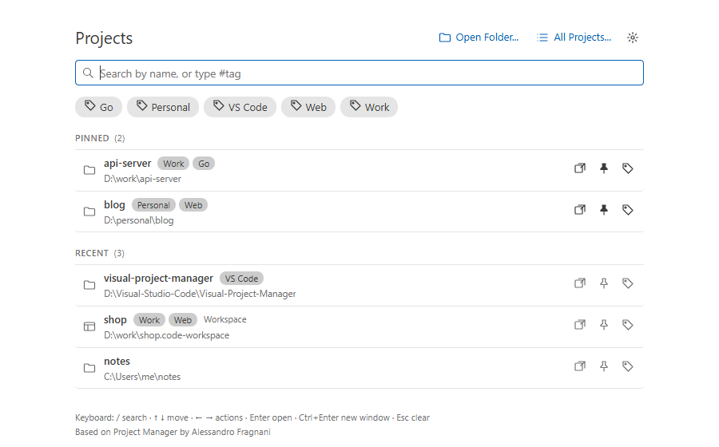
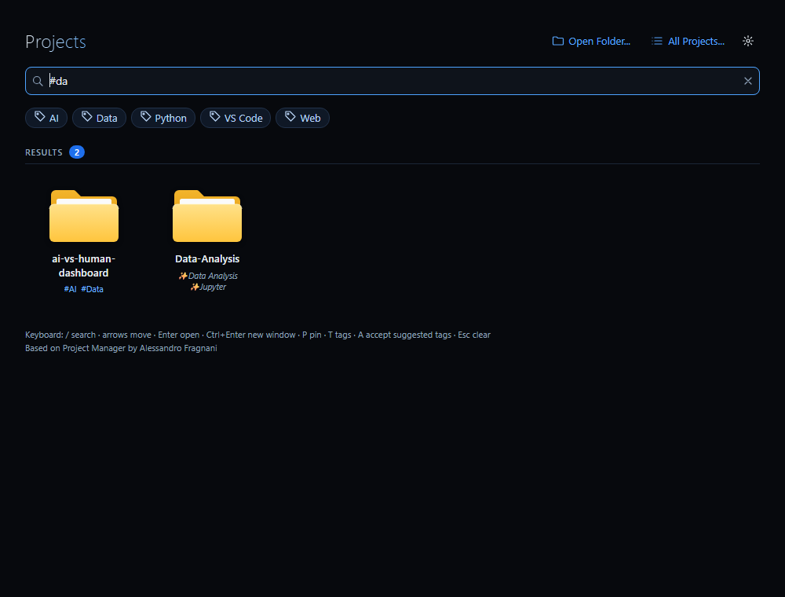
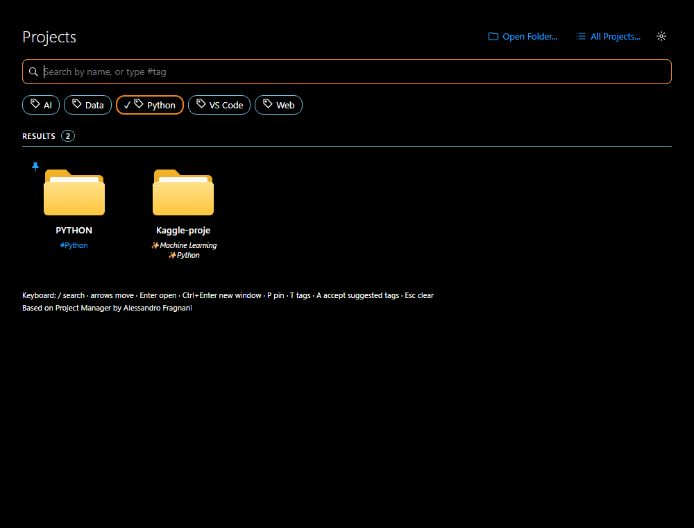

# Visual Project Manager

A **Projects page** that opens instead of the classic Welcome page, with **pinned** and **recently opened** projects, search by **name** or **#tag**, and a more accessible **Side Bar**.

<!-- SCREENSHOTS: the images below are generated by `npm run screenshots` (scripts/screenshots.js). Regenerate them after any visual change in `media/`. -->
<p align="center">
  
</p>

<table>
  <tr>
    <td align="center"><br/><sub>Light theme</sub></td>
    <td align="center"><br/><sub>Search by <code>#tag</code></sub></td>
    <td align="center"><br/><sub>High Contrast theme</sub></td>
  </tr>
</table>
<!-- /SCREENSHOTS -->

> **Visual Project Manager is a fork of [Project Manager](https://github.com/alefragnani/vscode-project-manager) by [Alessandro Fragnani](https://github.com/alefragnani).**
> All of the original features (Favorites, Tags, auto-detection of Git/Mercurial/SVN/VS Code/any folders, Status Bar, Profiles, Remotes) come from that project, and it is distributed under the same [GPLv3 license](LICENSE.md). Many thanks to Alessandro and all Project Manager contributors.

## What's new in this fork

### Projects page
* Opens on startup instead of the VS Code **Welcome** page, also as a new tab when VS Code reopens your last project (setting `projectManager.home.showOnStartup`: `always` (default), `emptyWindow` or `never`)
* Opens fast: the extension starts with VS Code, the page opens before any project scan, and the last projects are displayed from a cache while fresh data loads
* **Pinned** projects at the top, followed by the **Recent** local projects (from the VS Code _Open Recent_ history, local folders and workspaces only)
* One search box: type a project name, or `#tag` to filter by tag. Tag chips can also be used as a filter
* Pin/unpin, open in a new window and edit tags right from each row
* Command `Project Manager: Open Projects Page` (`Ctrl+Alt+H` / `Cmd+Alt+H`)

### Automatic tags
Nobody wants to tag dozens of projects by hand, so tags are **suggested automatically** from the files of each project (shown as ✨ _suggested_ until you accept them with the `A` key, the ✨ button, or the Edit Tags picker):

* **Technology tags** come from exact rules: `*.ipynb` → `Jupyter`, `*.py` / `requirements.txt` → `Python`, `pubspec.yaml` → `Flutter`, `pandas` dependency or import → `Pandas`...
* **Category tags** (`Data Analysis`, `Machine Learning`, `Mobile Development`, `Web Development`, `Software Development`, `DevOps`, `Game Development`) are decided by [Ollaya](https://ollaya.dev), a local decision model runtime, when it is running. Each category is a yes/no question answered with a probability; the ones above the threshold are suggested. Without Ollaya, simple fallback rules are used.
* Only a small summary is used (folder name, file type counts, top level files, dependencies and the start of the README). Everything runs **locally**: nothing leaves your computer.
* Edit the rules and categories with `Project Manager: Edit Automatic Tag Decisions`. Settings: `projectManager.autoTags.enabled`, `projectManager.autoTags.engine` (`auto`, `rules`, `ollaya`), `projectManager.autoTags.ollaya.url`, `projectManager.autoTags.ollaya.model`

### Tags on GitHub
Tags can be shared with everybody through **GitHub topics** (the tags displayed on a repository page, and used by the GitHub search):

* Use `Sync Tags with GitHub Topics` (the ☁ button or the `G` key in the Projects page, the project context menu in the Side Bar, or the Command Palette for the current folder)
* **Reading is automatic**: the topics of a public repository are suggested as ✨ tags, without signing in (refreshed once a day; setting `projectManager.autoTags.gitHubTopics`)
* **Publishing only shares technologies and categories** (`Python`, `Jupyter`, `Data Analysis`...), because topics are public. Personal tags like `Work` or a customer name always stay private
* Tags become topics (`Data Analysis` → `data-analysis`, `C#` → `csharp`) and topics become tags. Nothing is ever removed
* You always confirm what will be added before anything is written to GitHub. It signs in with the smallest permission (`public_repo`); the permission for private repositories is only requested for a private repository

To use Ollaya, install it from [ollaya.dev](https://ollaya.dev) and keep it running (default address `http://localhost:11435`).

### Side Bar
* A new **Pinned** view at the top of the Side Bar
* A new **Search** view, which filters the _Pinned_ and _Favorites_ views by name, `#tag` and tag chips
* Pin/unpin projects with the inline button, or from the context menu

### Accessibility
* Everything works with the keyboard only:

  | Key | Action |
  |-----|--------|
  | `/` | Focus the search box |
  | `↑` `↓` / `Home` `End` | Move between projects |
  | `←` `→` | Move between the actions of a project (new window, pin, tags) |
  | `Enter` / `Ctrl+Enter` | Open the project / open it in a new window |
  | `Esc` | Clear the search |

* Proper labels and roles for screen readers, and the number of results is announced while you type
* Colors come from the active theme, so light, dark and **High Contrast** themes are supported. Focus is always visible
* Honors the _reduce motion_ preference of the operating system

### Bundled with vscode-icons
Installing **Visual Project Manager** also installs [vscode-icons](https://github.com/vscode-icons/vscode-icons) (an [Extension Pack](https://code.visualstudio.com/api/references/extension-manifest#extension-packs) dependency), created and maintained by the [vscode-icons team](https://github.com/vscode-icons/vscode-icons/graphs/contributors) and licensed under the [MIT License](https://github.com/vscode-icons/vscode-icons/blob/master/LICENSE). You can uninstall or disable it independently at any time.

## Development

```bash
git clone https://github.com/dogiergin/visual-project-manager.git
cd visual-project-manager
git submodule update --init
npm install
npm run build          # or: npm run watch
npm test
```

* Press `F5` in VS Code to launch the Extension Development Host
* The UI of the Projects page and of the Side Bar Search view lives in [`media/`](media/) (plain HTML/CSS/JS, themed with VS Code CSS variables)
* After a visual change, run `npm run screenshots` to update the images in [`images/screenshots/`](images/screenshots/) used by this README

## Migrating from Project Manager
* Both extensions register the same commands and settings, so **uninstall or disable Project Manager** before using Visual Project Manager
* Your `projectManager.*` settings keep working, and your saved projects (`projects.json`) are copied automatically on the first run
* Pinned projects are stored with an extra `"pinned": true` field in `projects.json`, which the original extension simply ignores

## Credits

* [Project Manager](https://github.com/alefragnani/vscode-project-manager) by Alessandro Fragnani - GPLv3. If you find this extension useful, please consider supporting the original author as well:

  **Project Manager** is an extension created for **Visual Studio Code**. If you find it useful, please consider supporting it.

  <table align="center" width="60%" border="0">
    <tr>
      <td>
        <a title="Paypal" href="https://www.paypal.com/cgi-bin/webscr?cmd=_donations&business=EP57F3B6FXKTU&lc=US&item_name=Alessandro%20Fragnani&item_number=vscode%20extensions&currency_code=USD&bn=PP%2dDonationsBF%3abtn_donate_SM%2egif%3aNonHosted"></a>
      </td>
      <td>
        <a title="GitHub Sponsors" href="https://github.com/sponsors/alefragnani"></a>
      </td>
      <td>
        <a title="Patreon" href="https://www.patreon.com/alefragnani"></a>
      </td>
    </tr>
  </table>

* [vscode-icons](https://github.com/vscode-icons/vscode-icons) by the vscode-icons team - MIT
* [Ollaya](https://ollaya.dev) - optional local decision runtime used for the category tags (Apache-2.0, not bundled)

# Project Manager features

> The sections below come from the original [Project Manager](https://github.com/alefragnani/vscode-project-manager) documentation and still apply to Visual Project Manager.

It helps you to easily access your **projects**, no matter where they are located. _Don't miss those important projects anymore_. 

You can define your own **Projects** (also called **Favorites**), or choose for auto-detect **Git**, **Mercurial** or **SVN** repositories, **VSCode** folders, or **any** other folder.

Here are some of the features that **Project Manager** provides:

* Save any folder or workspace as a **Project**
* Auto-detect **Git**, **Mercurial** or **SVN** repositories
* Organize your projects using **Tags**
* Open projects in the same or new window
* Identify _deleted/renamed_ projects
* A **Status Bar** which identifies the current project
* A dedicated **Side Bar**

# Features

## Available Commands

* `Project Manager: Save Project` Save the current folder/workspace as a new project
* `Project Manager: Edit Project` Edit your projects manually (`projects.json`)
* `Project Manager: List Projects to Open` List all saved/detected projects and pick one
* `Project Manager: List Projects to Open in New Window` List all saved/detected projects and pick one to be opened in New Window
* `Project Manager: Filter Projects by Tag` Filter the Favorite projects by selected tags

## Manage your projects

### Save Project

You can save the current folder/workspace as a **Project** at any time. You just need to type its name. 


> It suggests a name to you _automatically_ :)
 
### Edit Projects

For easier customization of your project list, you can edit the `projects.json` file, directly inside **Code**. Just execute `Project Manager: Edit Projects` and the `projects.json` file is opened. Simple as this:

```json
[
    {
        "name": "Pascal MI",
        "rootPath": "c:\\PascalProjects\\pascal-menu-insight",
        "tags": [],
        "enabled": true,
        "profile": "Delphi"
    },
    {
        "name": "Bookmarks",
        "rootPath": "$home\\Documents\\GitHub\\vscode-bookmarks",
        "tags": [
            "Personal",
            "VS Code"
        ],
        "enabled": true,
        "profile": "VSCode"
    },
    {
        "name": "Numbered Bookmarks",
        "rootPath": "~\\Documents\\GitHub\\vscode-numbered-bookmarks",
        "tags": [
            "Personal",
            "VS Code"
        ],
        "enabled": false,
        "profile": "VSCode"
    }
]
```

> You can use `~` or `$home` while defining any path. It will be replaced by your HOME folder.

> Be sure that the JSON file is well-formed. Otherwise, **Project Manager** will not be able to open it, and an error message like this should appear. In this case, you should use the `Open File` button to fix it.


## Access 

### List Projects to Open

Shows your projects and select one to open.

### List Projects to Open in New Window

Just like **List Projects** but always opening in **New Window**.

## Keyboard Focused Users

If you are a keyboard focused user and uses _Vim like_ keyboard navigation, you can navigate thru the project list with your own keybindings. 

Just use the `when` clause `"inProjectManagerList"`, like:

```json
    {
        "key": "cmd+j",
        "command": "workbench.action.quickOpenSelectNext",
        "when": "inProjectManagerList && isMac"
    },
    {
        "key": "cmd+shift+j",
        "command": "workbench.action.quickOpenSelectPrevious",
        "when": "inProjectManagerList && isMac"
    },
    {
        "key": "ctrl+j",
        "command": "workbench.action.quickOpenSelectNext",
        "when": "inProjectManagerList && (isWindows || isLinux)"
    },
    {
        "key": "ctrl+shift+j",
        "command": "workbench.action.quickOpenSelectPrevious",
        "when": "inProjectManagerList && (isWindows || isLinux)"
    }
```

## Working with Remotes

The extension support [Remote Development](https://code.visualstudio.com/docs/remote/remote-overview) scenarios, and you may choose how to use it, depending on your needs

### I access Remotes, but most of my work is Local

This is the _regular_ scenario, and that's why you don't need to do anything special for the extension to work. It works out of the box.

When installed locally, you can save any Container, SSH, WSL or Codespaces projects as Favorites. Each one will have its own icon to be properly identified, and when you select them, VS Code will open the remote automatically.

_It just works_

### But what if I do most of my work on Remotes

If you normally connect to remotes (like SSH/WSL) and would like to save Favorite projects on that remote, or to be able to auto-detect repos located on that remote, you must activate/install the extension to work on remotes. 

You just have to add the lines below on your `User Settings`.

```json
    "remote.extensionKind": {
        "emredogukanergin.visual-project-manager": [
            "workspace"
        ]
    },
```

> More details on [VS Code documentation](https://code.visualstudio.com/docs/remote/containers#_advanced-forcing-an-extension-to-run-locally-or-remotely)

## Available Settings

You can choose how your projects are sorted

* `Saved`: The order that you saved the projects
* `Name`: The name that you typed for the project
* `Path`: The full path of the project
* `Recent`: The recently used projects

```json
    "projectManager.sortList": "Name"
```


* Choose if the project list must be grouped by its _kind_ (**Favorites**, **Git**, **Mercurial**, **SVN** and **VS Code**).

```json
    "projectManager.groupList": true
```

* Should the current project be removed from the list? (`false` by default)

```json
    "projectManager.removeCurrentProjectFromList": true
```

* Should identify _invalid paths_ on project list? (`true` by default)

```json 
    "projectManager.checkInvalidPathsBeforeListing": false
```

* Should support symlinks on `baseFolders`? (`false` by default)

```json 
    "projectManager.supportSymlinksOnBaseFolders": true
```

* Should show the parent folder info when projects with same name are detected? (`false` by default)

```json 
    "projectManager.showParentFolderInfoOnDuplicates": true
```

* Filter Projects Through Full Path (`false` by default)

```json 
    "projectManager.filterOnFullPath": true
```

* Custom projects file (`projects.json`) location

If you intend to _share_ projects between  **Stable** and **Insider** installations, or if you store your settings in different locations (cloud services), you can indicate an _alternative_ location (folder path) for the `projects.json` file.

```json
    "projectManager.projectsLocation": "C:\\Users\\myUser\\AppData\\Roaming\\Code\\User"
```

> You can use `~` or `$home` while defining the folder path. It will be replaced by your HOME folder.

* Automatic Detection of Projects (**Git** , **Mercurial** , **SVN**  and **VSCode** )

```json
    "projectManager.git.baseFolders": [
        "c:\\Projects\\code",
        "d:\\MoreProjects\\code-*",
        "$home\\personal-coding"
    ]
```
> Indicates folders or [glob patterns](https://code.visualstudio.com/docs/editor/glob-patterns) to search for projects

```json
    "projectManager.git.ignoredFolders": [
        "node_modules", 
        "out", 
        "typings", 
        "test",
        "fork*"
    ],
```
> Indicates folders or [glob patterns](https://code.visualstudio.com/docs/editor/glob-patterns) to be ignored when searching for projects

```json
    "projectManager.git.maxDepthRecursion": 4
```
> Define how deeps it should search for projects

* Exclude the base folders themselves from the auto-detected projects list (`false` by default)

```json
    "projectManager.any.excludeBaseFoldersFromResults": true
```
> When enabled, the **Any** base folders configured in `projectManager.any.baseFolders` are not returned as projects themselves, only their matching subfolders are.

* Should ignore projects found inside other projects? (`false` by default)

```json 
    "projectManager.ignoreProjectsWithinProjects": true
```

* Cache automatically detected projects (`true` by default)

```json 
    "projectManager.cacheProjectsBetweenSessions": false
```

* Display the Project Name in Status Bar (`true` by default)

```json 
    "projectManager.showProjectNameInStatusBar": true
```

* Open projects in _New Window_ when clicking in status bar (`false` by default)

```json 
    "projectManager.openInNewWindowWhenClickingInStatusBar": true
```

* Indicates if the `New Window` command should open the project in current window, when empty (`always` by default)

  * `always`: Whenever you call the Open in New Window command, it will open in the current window, if empty
  * `onlyUsingCommandPalette`: Only open in the current window if you use the Command Palette
  * `onlyUsingSideBar`: Only open in the current window if you use the Side Bar
  * `never`: Works as today. The Open in New Window command will always open in New Window

```json 
    "projectManager.openInCurrentWindowIfEmpty": "always"
```

* Indicates the list of tags you can use to organize your projects _(`Personal` and `Work` by default)_

```json
    "projectManager.tags": [
        "Personal", 
        "Work",
        "VS Code",
        "Learning"
    ]
```

* Controls how tag groups in the Favorites view are expanded or collapsed, and whether their state is remembered (`startExpanded` by default)

  * `alwaysExpanded`: Tag groups are always expanded
  * `alwaysCollapsed`: Tag groups are always collapsed
  * `startExpanded`: Tag groups start expanded and remember your last expand/collapse state
  * `startCollapsed`: Tag groups start collapsed and remember your last expand/collapse state

```json
    "projectManager.tags.collapseItems": "startExpanded"
```

* Show the current Git branch name for projects (`"never"` by default)

```json
    "projectManager.git.showBranchName": "never"
```

Supported values:
- `"never"`: Never display the Git branch name
- `"onlyInSideBar"`: Display the Git branch name only in the Side Bar
- `"onlyInCommandPalette"`: Display the Git branch name only in the Command Palette
- `"always"`: Display the Git branch name in all locations


## Available Colors

* Choose the foreground color to highlight the current project in the Side Bar
```json
    "workbench.colorCustomizations": {
      "projectManager.sideBar.currentProjectHighlightForeground": "#e13015"  
    }
```

## Side Bar

The **Project Manager** extension has its own **Side Bar**, with a variety of commands to improve your productivity. 


### Project Tags - View and Filter

Starting in v12.3, you can now organize your Projects with **Tags**. 

You can define your custom tags (via `projectManager.tags` setting), define multiple **tags** for each project, and filter the projects based on their **tags**. 


## Extension API

If you are an extension developer and would like to interact with the **Project Manager** extension, you can use its public API. 

First, you must add an `extensionDependencies` entry in your `package.json` file:

```json
  "extensionDependencies": [
    "emredogukanergin.visual-project-manager"
  ],
```

Then, retrieve the extension instance with `vscode.extensions.getExtension("emredogukanergin.visual-project-manager")` in your source code, to be able to use the methods that the extension exposes.

```ts
import { ProjectManagerPublicApi } from './api/projectManager/api';

async function useProjectManagerApi() {
    const projectManagerApi = <ProjectManagerPublicApi>vscode.extensions.getExtension('emredogukanergin.visual-project-manager')?.exports;

    await projectManagerApi.saveProject("My Project", "/path/to/project", ["work"], "Default");
}
```

The contract is defined at [/api/api.d.ts](/api/api.d.ts).

> More details on [VS Code Extension API reference](https://code.visualstudio.com/api/references/vscode-api#extensions)

## Installation and Configuration

You should follow the official documentation to:

- [Install the extension](https://code.visualstudio.com/docs/editor/extension-gallery)
- [Modify its settings](https://code.visualstudio.com/docs/getstarted/settings)

# License

[GPL-3.0 with VS Code Extension Host API Exception](LICENSE.md)

* Original work &copy; Alessandro Fragnani ([Project Manager](https://github.com/alefragnani/vscode-project-manager))
* Modifications &copy; Emre Doğukan Ergin and Visual Project Manager contributors

See [NOTICE.md](NOTICE.md) for the third-party attributions.
